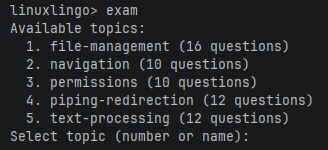

# LinuxLingo User Guide

LinuxLingo is a **command-line application for learning Linux commands** through an interactive shell simulator and a built-in quiz system. It is optimised for Computer Science students who want to build confidence with the Linux command line by typing real commands, seeing real output, and testing their knowledge with quizzes -- all within a safe, in-memory virtual file system (VFS) that never touches your real files.

---

- [Quick Start](#quick-start)
- [Features](#features)
  - [Main Menu Commands](#main-menu-commands)
  - [Shell Simulator](#shell-simulator)
  - [Navigation Commands](#navigation-commands)
  - [File Operation Commands](#file-operation-commands)
  - [Text Processing Commands](#text-processing-commands)
  - [Permission Commands](#permission-commands)
  - [Information Commands](#information-commands)
  - [Alias and History Commands](#alias-and-history-commands)
  - [Environment Management Commands](#environment-management-commands)
  - [Utility Commands](#utility-commands)
  - [Piping and Redirection](#piping-and-redirection)
  - [Command Chaining](#command-chaining)
  - [Glob Expansion](#glob-expansion)
  - [Variable Expansion](#variable-expansion)
  - [Tab Completion](#tab-completion)
  - [Typo Suggestions](#typo-suggestions)
  - [Exam System](#exam-system)
- [Data Storage](#data-storage)
- [FAQ](#faq)
- [Known Issues](#known-issues)
- [Command Summary](#command-summary)

---

## Quick Start

1. Ensure you have **Java 17** or above installed in your computer.
2. Download the latest `LinuxLingo.jar` from the [LinuxLingo releases page](https://github.com/AY2526S2-CS2113-T10-2/tp/releases).
3. Copy the file to a folder you want to use as the *home folder* for LinuxLingo.
4. Open a command terminal, `cd` into the folder you put the JAR file in, and run:

   ```sh
   java -jar LinuxLingo.jar
   ```

5. A welcome banner and a `linuxlingo>` prompt should appear. Type `help` and press Enter to see available commands.
6. Some example commands to try:
   - `shell` -- enter the Shell Simulator to practice Linux commands.
   - `exam` -- start a quiz on Linux topics.
   - `exit` -- exit the application.
7. Refer to the [Features](#features) section below for details on each command.

---

## Features

> [i] **Notes about the command format:**
>
> - Words in `UPPER_CASE` are parameters to be supplied by the user.
>   e.g. in `cd DIRECTORY`, `DIRECTORY` is a parameter: `cd /home/user`.
> - Items in square brackets `[...]` are optional.
>   e.g. `cd [DIRECTORY]` can be used as `cd` or `cd /home`.
> - Items with `...` after them can be used multiple times.
>   e.g. `touch FILE [FILE...]` can be used as `touch a.txt` or `touch a.txt b.txt c.txt`.
> - Flags (e.g., `-r`, `-l`) can appear in any order before file arguments. Short flags can be combined (e.g., `-la` is equivalent to `-l -a`).
> - Both single quotes (`'...'`) and double quotes (`"..."`) can be used to treat text as a single argument (e.g., `echo "hello world"`). Inside single quotes, all characters are treated literally (no variable or glob expansion).
> - Outside of quotes, a backslash (`\`) escapes the next character, treating it as a literal. e.g. `echo hello\ world` passes `hello world` as a single argument.

### Main Menu Commands

LinuxLingo has two modes of operation:

| Mode | How to Enter | Description |
| ---- | ------------ | ----------- |
| **Interactive mode** | `java -jar LinuxLingo.jar` (no arguments) | Starts the main REPL. You can freely switch between shell, exam, and other commands. |
| **One-shot mode** | With command-line arguments (e.g., `java -jar LinuxLingo.jar exec "ls"`) | Executes a single command and exits. Useful for scripting or quick checks. |

When in interactive mode, the `linuxlingo>` prompt accepts the following top-level commands.

#### Entering the Shell Simulator: `shell`

Enters the interactive Shell Simulator where you can practice Linux commands on the virtual file system.

Format: `shell`

- You will see a shell prompt like `user@linuxlingo:/$`.
- Type `exit` to return to the main menu.

#### Starting an Exam: `exam`

Starts an exam session. See the [Exam System](#exam-system) section for full details.

Format: `exam [-t TOPIC] [-n COUNT] [-random] [-topics]`

Examples:

- `exam` -- start an interactive exam (prompts you to choose a topic).
- `exam -t navigation -n 5` -- 5 questions from the "navigation" topic.
- `exam -random` -- one random question from any topic.
- `exam -topics` -- list all available topics.

#### One-shot command execution: `exec`

Executes a single shell command and prints the result, without entering the Shell Simulator.

Format: `exec "COMMAND"` or `exec -e ENV_NAME "COMMAND"`

- The command string should be enclosed in quotes.
- Use `-e ENV_NAME` to run the command in a previously saved environment.

Examples:

- `exec "echo hello"` -- prints `hello`.
- `exec -e myenv "ls"` -- lists files in the saved environment `myenv`.

#### Viewing help: `help`

Displays a list of available main menu commands.

Format: `help`

#### Exiting the application: `exit`

Exits LinuxLingo.

Format: `exit`

Alternatives: `quit`

---

### Shell Simulator

The Shell Simulator provides a Linux-like command-line environment backed by an in-memory virtual file system (VFS). All file and directory operations are performed within this VFS -- **no real files on your computer are created, modified, or deleted** by shell commands.

When you enter the Shell Simulator, you will see a prompt like:

```text
user@linuxlingo:/$
```

The prompt shows your current working directory. Type Linux commands and press Enter to execute them.

The default VFS contains the following directories: `/home/user`, `/tmp`, and `/etc` (with a `hostname` file).

---

### Navigation Commands

#### Printing the working directory: `pwd`

Prints the absolute path of the current working directory.

Format: `pwd`

Example:

```text
user@linuxlingo:/home/user$ pwd
/home/user
```

#### Changing directory: `cd`

Changes the current working directory.

Format: `cd [DIRECTORY]`

- `cd` or `cd ~` -- go to `/home/user`.
- `cd ..` -- go to the parent directory.
- `cd -` -- go to the previous working directory.
- `cd /absolute/path` -- go to an absolute path.
- `cd relative/path` -- go to a path relative to the current directory.

Examples:

```text
user@linuxlingo:/$ cd /home/user
user@linuxlingo:/home/user$ cd ..
user@linuxlingo:/home$ cd -
user@linuxlingo:/home/user$
```

#### Listing directory contents: `ls`

Lists the contents of a directory.

Format: `ls [-a] [-l] [-R] [DIRECTORY...]`

- `-a` -- show all files, including hidden files (names starting with `.`). Note: `.` and `..` pseudo-entries are not displayed.
- `-l` -- use long listing format, showing file type, permissions, link count, owner, group, size, and name.
- `-R` -- list subdirectories recursively.
- If no directory is given, lists the current directory.

Examples:

```text
user@linuxlingo:/$ ls
home/
tmp/
etc/

user@linuxlingo:/$ ls -l /home
drwxr-xr-x  1 user user  0  user/

user@linuxlingo:/$ ls -a
.hidden
home/
tmp/
etc/
```

---

### File Operation Commands

#### Creating directories: `mkdir`

Creates one or more directories.

Format: `mkdir [-p] DIRECTORY [DIRECTORY...]`

- `-p` -- create parent directories as needed (no error if they already exist).

Examples:

- `mkdir projects` -- create a single directory.
- `mkdir -p projects/java/src` -- create nested directories.
- `mkdir dir1 dir2 dir3` -- create multiple directories at once.

#### Creating files: `touch`

Creates one or more empty files. If a file already exists, the command has no effect.

Format: `touch FILE [FILE...]`

Examples:

- `touch readme.txt` -- create a single file.
- `touch file1.txt file2.txt file3.txt` -- create multiple files at once.

#### Displaying file contents: `cat`

Displays the contents of one or more files. If multiple files are given, their contents are concatenated.

Format: `cat [-n] FILE [FILE...]`

- `-n` -- number all output lines.
- Also accepts piped stdin (e.g., `echo "text" | cat`).

Example:

```text
user@linuxlingo:/$ cat -n readme.txt
     1  Hello, world!
```

#### Outputting text: `echo`

Prints text to the terminal. Often used with redirection to write to files.

Format: `echo [-n] [-e] [TEXT...]`

- `-n` -- do not output a trailing newline.
- `-e` -- interpret backslash escape sequences (`\n`, `\t`, `\\`, `\a`, `\b`).

Examples:

- `echo Hello World` -- prints `Hello World`.
- `echo "Hello World" > greeting.txt` -- writes text to a file.
- `echo -e "line1\nline2"` -- prints two lines.

#### Removing files or directories: `rm`

Removes files or directories.

Format: `rm [-r] [-f] FILE [FILE...]`

- `-r` -- remove directories and their contents recursively.
- `-f` -- force removal, ignore non-existent files without errors.

Examples:

- `rm file.txt` -- remove a file.
- `rm -r projects/` -- remove a directory and its contents.
- `rm -rf old_dir/` -- force-remove a directory.

#### Copying files or directories: `cp`

Copies files or directories.

Format: `cp [-r] SOURCE [SOURCE...] DESTINATION`

- `-r` -- copy directories recursively.
- When copying multiple sources, the destination must be an existing directory.

Examples:

- `cp file.txt backup.txt` -- copy a file.
- `cp -r src/ src_backup/` -- copy a directory.
- `cp file1.txt file2.txt docs/` -- copy multiple files into a directory.

#### Moving or renaming files: `mv`

Moves or renames files and directories.

Format: `mv SOURCE [SOURCE...] DESTINATION`

- When moving multiple sources, the destination must be an existing directory.

Examples:

- `mv old_name.txt new_name.txt` -- rename a file.
- `mv file.txt /home/user/docs/` -- move a file to another directory.
- `mv file1.txt file2.txt docs/` -- move multiple files into a directory.

#### Comparing files: `diff`

Compares two files line by line and displays the differences.

Format: `diff FILE1 FILE2`

- Lines only in the first file are prefixed with `-`.
- Lines only in the second file are prefixed with `+`.
- If the files are identical, no output is produced.

Example:

```text
user@linuxlingo:/$ diff old.txt new.txt
--- old.txt
+++ new.txt
-old line
+new line
```

#### Writing stdin to files: `tee`

Reads from stdin, writes to one or more files, and also outputs to stdout. Useful in pipelines to save intermediate output.

Format: `tee [-a] FILE [FILE...]`

- `-a` -- append to the files instead of overwriting.

Example:

```text
user@linuxlingo:/$ echo "hello" | tee output.txt
hello
```

---

### Text Processing Commands

#### Displaying the first lines: `head`

Displays the first N lines of a file (default: 10). Supports multiple files and piped input.

Format: `head [-n COUNT] [-COUNT] [FILE...]`

- `-n COUNT` -- number of lines to display. A negative value (e.g., `-n -3`) displays all lines except the last 3.
- `-COUNT` -- legacy shorthand for `-n COUNT` (e.g., `head -5 file.txt` is the same as `head -n 5 file.txt`).
- When multiple files are given, each file's output is preceded by a `==> filename <==` header.

Examples:

- `head -n 5 logfile.txt` -- show first 5 lines.
- `cat longfile.txt | head -n 3` -- show first 3 lines of piped input.

#### Displaying the last lines: `tail`

Displays the last N lines of a file (default: 10). Supports multiple files and piped input.

Format: `tail [-n COUNT] [-COUNT] [FILE...]`

- `-n COUNT` -- number of lines from the end. Use `-n +N` to output starting from line N.
- `-COUNT` -- legacy shorthand for `-n COUNT` (e.g., `tail -5 file.txt` is the same as `tail -n 5 file.txt`).
- When multiple files are given, each file's output is preceded by a `==> filename <==` header.

Example:

- `tail -n 20 logfile.txt` -- show last 20 lines.

#### Searching for patterns: `grep`

Searches for lines matching a pattern in files or piped input.

Format: `grep [-i] [-v] [-n] [-c] [-l] [-E] PATTERN [FILE...]`

- `-i` -- case-insensitive matching.
- `-v` -- invert match (show lines that do NOT match).
- `-n` -- prefix each matching line with its line number.
- `-c` -- only print a count of matching lines.
- `-l` -- only list the names of files containing matches.
- `-E` -- interpret PATTERN as an extended regular expression.

> [Note] **Note:** By default, `grep` performs literal substring matching. Use `-E` to enable regular expression matching.

Examples:

- `grep "error" logfile.txt` -- search for "error" in a file.
- `grep -in "warning" logfile.txt` -- case-insensitive search with line numbers.
- `cat data.txt | grep -v "comment"` -- filter out lines containing "comment".
- `grep -E "error|warning" logfile.txt` -- search using regex alternation.

#### Finding files: `find`

Searches for files by name, type, or size within a directory tree.

Format: `find [DIRECTORY] [-name PATTERN] [-type TYPE] [-size SIZE]`

- `-name PATTERN` -- glob pattern to match file names (default: `*`).
- `-type f` -- match files only. `-type d` -- match directories only.
- `-size [+|-]N` -- match by size in bytes. `+N` for larger, `-N` for smaller, `N` for exactly.
- If no directory is given, searches the current directory.

Examples:

- `find /home -name "*.txt"` -- find all `.txt` files under `/home`.
    ```text
    user@linuxlingo:/$ touch /home/a.txt /home/b.txt
    user@linuxlingo:/$ find /home -name "*.txt"
    /home/a.txt
    /home/b.txt
    ```

- `find / -type d -name "src"` -- find directories named "src".
- `find /home -name "*.log" -size +100` -- find log files larger than 100 bytes.

#### Counting lines, words, and characters: `wc`

Counts lines, words, and characters in files or piped input. When multiple files are given, a total line is appended.

Format: `wc [-l] [-w] [-c] [FILE...]`

- `-l` -- count lines only.
- `-w` -- count words only.
- `-c` -- count characters only.
- No flags -- show all three counts, in order of lines, words, and characters.

Examples:

- `wc readme.txt` -- show line, word, and character counts.
    ```text
    user@linuxlingo:/home/user$ echo "hello" > hello.txt
    user@linuxlingo:/home/user$ wc hello.txt
    1 1 6 hello.txt
    ```

- `echo "hello world" | wc -w` -- count words in piped input.
    ```text
    user@linuxlingo:/home/user$ echo "hello" | wc -w
    1
    ```

#### Sorting lines: `sort`

Sorts lines of text in a file or piped input.

Format: `sort [-r] [-n] [-u] [FILE]`

- `-r` -- sort in reverse order.
- `-n` -- sort numerically.
- `-u` -- output only unique lines (remove duplicates after sorting).

Examples:

- `sort names.txt` -- sort lines alphabetically.
- `cat numbers.txt | sort -rn` -- sort numerically in reverse.

#### Removing adjacent duplicates: `uniq`

Removes adjacent duplicate lines from input.

Format: `uniq [-c] [-d] [FILE]`

- `-c` -- prefix each line with the number of occurrences.
- `-d` -- only print duplicate lines (lines that appear more than once adjacently).

> [Tip] **Tip:** `uniq` only removes *adjacent* duplicates. Use `sort | uniq` to remove all duplicates.

Example:

```text
user@linuxlingo:/$ sort data.txt | uniq -c
      3 apple
      1 banana
      2 cherry
```

---

### Permission Commands

#### Changing file permissions: `chmod`

Changes the permissions of a file or directory.

Format: `chmod [-R] MODE FILE`

- `-R` -- apply changes recursively to all files and subdirectories.

Supports two permission formats:

| Format | Example | Description |
| ------ | ------- | ----------- |
| Octal | `chmod 755 script.sh` | Sets permissions using a 3-digit octal number (owner/group/others). |
| Symbolic | `chmod u+x script.sh` | Modifies specific permissions using `[ugoa][+-=][rwx]` syntax. |

**Octal reference:**

| Digit | Permission |
| ----- | ---------- |
| 7 | `rwx` (read + write + execute) |
| 6 | `rw-` (read + write) |
| 5 | `r-x` (read + execute) |
| 4 | `r--` (read only) |
| 0 | `---` (no permissions) |

**Symbolic reference:**

- `u` = owner, `g` = group, `o` = others, `a` = all
- `+` = add, `-` = remove, `=` = set exactly
- `r` = read, `w` = write, `x` = execute

Examples:

- `chmod 644 data.txt` -- set read/write for owner, read-only for others.
- `chmod u+x script.sh` -- add execute permission for the owner.
- `chmod -R 755 project/` -- recursively set permissions.

---

### Information Commands

#### Displaying a command manual: `man`

Displays the manual page (name, synopsis, and description) for a given command.

Format: `man COMMAND`

Example:

```text
user@linuxlingo:/$ man grep
NAME
    grep - Search for pattern in file (use -E for regex)

SYNOPSIS
    grep [-E] [-i] [-v] [-n] [-c] [-l] <pattern> [file...]

DESCRIPTION
    Search for pattern in file (use -E for regex)
```

#### Displaying a directory tree: `tree`

Displays the directory structure as a tree, starting from the given path (or the current directory).

Format: `tree [DIRECTORY]`

Example:

```text
user@linuxlingo:/$ tree /home
home
└── user

1 directories, 0 files
```

#### Showing whether a command exists: `which`

Shows whether a command is available in LinuxLingo.

Format: `which COMMAND [COMMAND...]`

Example:

```text
user@linuxlingo:/$ which ls grep
ls: /bin/ls
grep: /bin/grep
```

#### Printing the current user: `whoami`

Prints the current username (always `user`).

Format: `whoami`

#### Displaying the date and time: `date`

Displays the current date and time.

Format: `date [+FORMAT]`

- Without a format, uses the default format (e.g., `Wed Apr 01 14:30:00 2026`).
- With `+FORMAT`, uses Linux strftime format specifiers (e.g., `%Y` for year, `%m` for month, `%d` for day).

Examples:

- `date` -- display date in default format.
- `date +%Y-%m-%d` -- display date as `2026-04-01`.

---

### Alias and History Commands

#### Managing command aliases: `alias`

Lists, creates, or views command aliases. Aliases let you define shortcuts for commonly used commands.

Format: `alias [NAME='VALUE']`

- `alias` (no arguments) -- list all aliases.
- `alias NAME='VALUE'` -- create an alias.
- `alias NAME` -- show the value of a specific alias.

Example:

```text
user@linuxlingo:/$ alias ll='ls -la'
user@linuxlingo:/$ ll
```

> [Note] **Note:** Quotes are required when the alias value contains spaces.
> `alias ll='ls -la'` works correctly; `alias ll=ls -la` will only alias `ll` to `ls`,
> silently ignoring `-la`.
> [Tip] **Tip:** Aliases persist only for the current shell session. They are not saved across restarts. *(Coming soon: persistent aliases across sessions.)*
> [Tip] **Tip:** Combined single-character flags like `-la` are automatically expanded to `-l -a` before the command runs, so both forms are accepted.
> [Tip] **Tip:** Aliases can chain, if `ll` is aliased to `ls -la` and `ls` is aliased to another command, LinuxLingo will follow the chain automatically. Circular aliases are detected and stopped safely.

#### Removing aliases: `unalias`

Removes one or more command aliases.

Format: `unalias [-a] NAME [NAME...]`

- `-a` -- remove all aliases.

Example:

- `unalias ll` -- remove the `ll` alias.

#### Viewing command history: `history`

Displays or manages the list of previously entered commands.

Format: `history [-c] [N]`

- `history` -- show all command history with line numbers.
- `history N` -- show the last N commands.
- `history -c` -- clear all command history.

Example:

```text
user@linuxlingo:/$ history
    1  ls
    2  cd /home/user
    3  mkdir projects
```

---
> [Note] **Note:** Every command you enter is recorded in history, including commands that fail or produce errors. The `history` command itself is not recorded (mimics bash behaviour). History resets when you leave the Shell Simulator.

`history 0` shows no output (not an error). *(Coming soon: improved validation with an informative message for invalid counts.)*

### Environment Management Commands

These commands let you save, load, and manage snapshots of the virtual file system, so you can preserve your work across sessions.

#### Saving an environment: `save`

Saves the current VFS state and working directory as a named snapshot.

Format: `save NAME`

- The name can only contain letters, digits, hyphens, and underscores.
- Snapshots are stored in the `data/environments/` folder.

Example:

```text
user@linuxlingo:/home/user$ save my-workspace
Environment saved: my-workspace
```

#### Loading an environment: `load`

Restores a previously saved VFS snapshot.

Format: `load NAME`

Example:

```text
user@linuxlingo:/$ load my-workspace
Environment loaded: my-workspace
user@linuxlingo:/home/user$
```

#### Resetting the environment: `reset`

Resets the VFS to its default initial state (standard directories only).

Format: `reset`

#### Listing saved environments: `envlist`

Lists all saved environment snapshots.

Format: `envlist`

#### Deleting a saved environment: `envdelete`

Deletes a saved environment snapshot.

Format: `envdelete NAME`

---

### Utility Commands

#### Viewing command help: `help`

Displays a list of all available shell commands, or detailed usage for a specific command.

Format: `help [COMMAND]`

Examples:

- `help` -- list all commands.
- `help grep` -- show usage and description for `grep`.

#### Clearing the screen: `clear`

Clears the terminal screen.

Format: `clear`

---

### Piping and Redirection

LinuxLingo supports piping and I/O redirection, just like a real Linux shell.

**Piping (`|`):** Connects the output of one command to the input of the next.

```text
user@linuxlingo:/$ echo "apple banana cherry" | wc -w
3
```

**Output redirection (`>`):** Writes command output to a file, overwriting existing content.

```text
user@linuxlingo:/$ echo "Hello" > greeting.txt
```

**Append redirection (`>>`):** Appends command output to a file.

```text
user@linuxlingo:/$ echo "World" >> greeting.txt
user@linuxlingo:/$ cat greeting.txt
Hello
World
```

**Input redirection (`<`):** Reads input from a file instead of the keyboard.

```text
user@linuxlingo:/$ wc -l < data.txt
5
```

---

### Command Chaining

You can chain multiple commands using operators:

| Operator | Behaviour | Example |
| -------- | --------- | ------- |
| `&&` | Run the next command only if the previous one **succeeded** (exit code 0). | `mkdir dir && cd dir` |
| `\|\|` | Run the next command only if the previous one **failed** (exit code != 0). | `cd missing \|\| echo "not found"` |
| `;` | Run the next command **regardless** of whether the previous one succeeded. | `echo start ; ls ; echo done` |

Examples:

```text
user@linuxlingo:/$ mkdir projects && cd projects && touch readme.txt
user@linuxlingo:/projects$

user@linuxlingo:/$ cat nonexistent.txt || echo "File not found"
File not found
```

---

### Glob Expansion

The shell supports glob patterns (`*` and `?`) to match multiple files at once.

- `*` -- matches any sequence of characters.
- `?` -- matches any single character.

If a glob pattern matches one or more files, it is expanded to the matching file names. If no files match, the pattern is passed through unchanged.

Example:

```text
user@linuxlingo:/$ touch a.txt b.txt c.log
user@linuxlingo:/$ ls *.txt
a.txt
b.txt
```

> [Tip] **Tip:** Glob expansion is suppressed inside single quotes: `echo '*.txt'` prints the literal string `*.txt`.

---

### Variable Expansion

The shell supports a limited set of shell variables, which are expanded when used with the `$` prefix.

| Variable | Value |
| -------- | ----- |
| `$USER` | `user` |
| `$HOME` | `/home/user` |
| `$PWD` | Current working directory |
| `$?` | Exit code of the last command (0 = success) |

Example:

```text
user@linuxlingo:/$ echo $HOME
/home/user

user@linuxlingo:/$ echo $?
0
```

> [Tip] **Tip:** Variable expansion is suppressed inside single quotes: `echo '$HOME'` prints the literal string `$HOME`.

---

### Tab Completion

LinuxLingo supports tab completion for faster input:

- Press **Tab** to auto-complete command names and file/directory paths.
- If there are multiple matches, pressing Tab twice shows all possibilities.

> [Tip] **Tip:** Tab completion also works with alias names.

---

### Typo Suggestions

If you type an unrecognised command name, LinuxLingo will suggest the closest matching command.

Example:

```text
user@linuxlingo:/$ grpe "hello" file.txt
grpe: command not found
Did you mean 'grep'?
```

---

### Exam System

LinuxLingo includes a built-in exam system to test your knowledge of Linux commands. Questions are drawn from a question bank covering multiple topics.



#### Starting an exam : `exam`

Starts an interactive exam session where you choose the topic and number of questions.

Format: `exam`

- Prompts you to select a topic by number or name.
- Prompts for the number of questions (press Enter for all questions in the topic).
- Shows feedback (✓ Correct! / ✗ Incorrect. and explanation) after each question.
- Shows a final score summary at the end.

> [Tip] **Tip:** Type `quit` to skip a question during an exam.

#### Topic-Based Exam with CLI Arguments: `exam -t`

Starts an exam for a specific topic, optionally with a limited number of questions and random order.
Format: `exam -t TOPIC [-n COUNT] [-random]`

- `-t TOPIC` -- specify the topic (e.g., `navigation`, `file-management`).
- `-n COUNT` -- number of questions (default: all questions in the topic).
- `-random` -- randomise question order.
- If COUNT is greater than the number of questions in the topic, it will use all available questions.

Example: `exam -t text-processing -n 5 -random`
Starts a 5-question exam from the `text-processing` topic with questions in random order.

#### Random question: `exam -random`

Asks you a single random question drawn from any topic.

Format: `exam -random`

- Useful for quick knowledge check
- The question type can be MCQ, FITB, or PRAC.
- Shows immediate feedback and explanation, then returns you to the main menu.

#### Listing topics: `exam -topics`

Shows all available exam topics and how many questions each contains.

Format: `exam -topics`

Example output:

```text
Available topics:
  1. file-management (16 questions)
  2. navigation (10 questions)
  3. permissions (10 questions)
  4. piping-redirection (12 questions)
  5. text-processing (12 questions)
```

#### Question types

| Type | Description | How to Answer |
| ---- | ----------- | ------------- |
| **MCQ** (Multiple Choice) | Choose the correct option from A, B, C, D. | Type the letter of your answer (e.g., `B`). |
| **FITB** (Fill In The Blank) | Fill in the missing command or argument. | Type the missing text exactly (e.g., `pwd`). |
| **PRAC** (Practical) | Perform a task in a temporary shell session. | Execute commands in the temporary shell, then type `exit` when done. The VFS is automatically checked. |

**PRAC question example flow:**

1. The question describes a task (e.g., "Navigate to /etc and verify that hostname file exists by using ls.").
2. You enter a temporary shell session with a fresh VFS.
3. You type the required commands (e.g., `cd /etc`, `ls`).
4. Type `exit` to submit.
5. LinuxLingo checks whether the VFS matches the expected state and gives feedback.


---

## Data Storage

LinuxLingo stores data in the `data/` folder, relative to where you run the JAR file.

- **Saved environments** are stored as `.env` files in `data/environments/`.
- **Question banks** are stored as `.txt` files in `data/questions/`. They are automatically extracted from the JAR on first run.

> [!] **Caution:** Manually editing `.env` or question bank files may cause errors if the format becomes invalid. Only edit these files if you understand the expected format.

---

## FAQ

**Q: How do I transfer my data to another computer?**

A: Copy the `data/` folder (which contains `environments/` and `questions/`) to the same location relative to the JAR file on the other computer.

**Q: Do shell commands affect real files on my computer?**

A: No. All shell commands operate on an in-memory virtual file system (VFS). No real files are created, modified, or deleted by shell commands. Only the `save` command writes data to disk (in `data/environments/`).

**Q: Can I add my own exam questions?**

A: Yes. Add `.txt` files to the `data/questions/` directory following the existing pipe-delimited format. They will be automatically loaded on the next startup.

**Q: Why is the VFS empty after restarting LinuxLingo?**

A: The VFS is in-memory and resets each time the application starts. Use the `save` command to persist your environment, and `load` to restore it in a future session.

**Q: How do I use aliases I defined in a previous session?**

A: Aliases only persist for the current shell session. You will need to redefine them each time you enter the Shell Simulator.

---

## Known Issues

1. **ANSI escape codes on Windows:** The `clear` command uses ANSI escape sequences which may not work correctly on older Windows command prompts. Use Windows Terminal or PowerShell for best results.
2. **Tab completion requires JLine:** Tab completion relies on the JLine library. If JLine cannot initialise (e.g., in some IDE terminals), the shell falls back to basic line input without tab completion.

---

## Command Summary

### Main Menu

| Command | Format | Description |
| ------- | ------ | ----------- |
| Shell | `shell` | Enter the Shell Simulator |
| Exam | `exam [-t TOPIC] [-n COUNT] [-random]` | Start an exam session |
| List Topics | `exam -topics` | List all available exam topics |
| Random Question | `exam -random` | Answer one random question |
| Exec | `exec "COMMAND"` | Execute a shell command and print result |
| Exec in Env | `exec -e ENV_NAME "COMMAND"` | Execute a command in a saved environment |
| Help | `help` | Show available commands |
| Exit | `exit` or `quit` | Exit the application |

### Shell Commands

| Command | Format | Description |
| ------- | ------ | ----------- |
| `pwd` | `pwd` | Print working directory |
| `cd` | `cd [DIRECTORY]` | Change directory |
| `ls` | `ls [-a] [-l] [-R] [DIRECTORY...]` | List directory contents |
| `mkdir` | `mkdir [-p] DIRECTORY...` | Create directories |
| `touch` | `touch FILE...` | Create empty files |
| `cat` | `cat [-n] FILE...` | Display file contents |
| `echo` | `echo [-n] [-e] [TEXT...]` | Print text |
| `rm` | `rm [-r] [-f] FILE...` | Remove files/directories |
| `cp` | `cp [-r] SOURCE... DEST` | Copy files/directories |
| `mv` | `mv SOURCE... DEST` | Move/rename files |
| `diff` | `diff FILE1 FILE2` | Compare two files line by line |
| `tee` | `tee [-a] FILE...` | Read stdin and write to files |
| `head` | `head [-n COUNT] [-COUNT] [FILE...]` | Display first N lines |
| `tail` | `tail [-n COUNT] [-COUNT] [FILE...]` | Display last N lines |
| `grep` | `grep [-i] [-v] [-n] [-c] [-l] [-E] PATTERN [FILE...]` | Search for pattern |
| `find` | `find [DIR] [-name PATTERN] [-type TYPE] [-size SIZE]` | Find files by name/type/size |
| `wc` | `wc [-l] [-w] [-c] [FILE...]` | Count lines/words/chars |
| `sort` | `sort [-r] [-n] [-u] [FILE]` | Sort lines |
| `uniq` | `uniq [-c] [-d] [FILE]` | Remove adjacent duplicates |
| `chmod` | `chmod [-R] MODE FILE` | Change permissions |
| `man` | `man COMMAND` | Display command manual |
| `tree` | `tree [DIRECTORY]` | Display directory tree |
| `which` | `which COMMAND...` | Show if command exists |
| `whoami` | `whoami` | Print current username |
| `date` | `date [+FORMAT]` | Display date and time |
| `alias` | `alias [NAME='VALUE']` | Manage command aliases |
| `unalias` | `unalias [-a] NAME...` | Remove aliases |
| `history` | `history [-c] [N]` | View/manage command history |
| `save` | `save NAME` | Save VFS snapshot |
| `load` | `load NAME` | Load VFS snapshot |
| `reset` | `reset` | Reset VFS to default |
| `envlist` | `envlist` | List saved environments |
| `envdelete` | `envdelete NAME` | Delete saved environment |
| `help` | `help [COMMAND]` | Show help |
| `clear` | `clear` | Clear screen |

### Operators

| Operator | Description |
| -------- | ----------- |
| `\|` | Pipe: connect output to next command's input |
| `>` | Redirect: write output to file (overwrite) |
| `>>` | Append: write output to file (append) |
| `<` | Input redirect: read input from file |
| `&&` | AND: run next command only if previous succeeded |
| `\|\|` | OR: run next command only if previous failed |
| `;` | Semicolon: run next command unconditionally |
